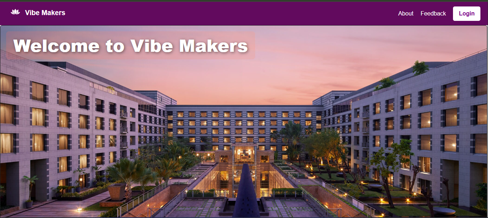
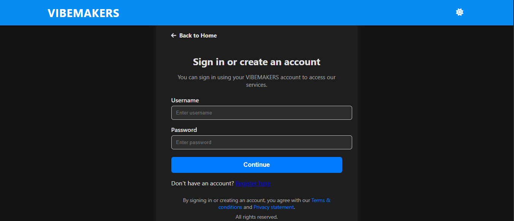
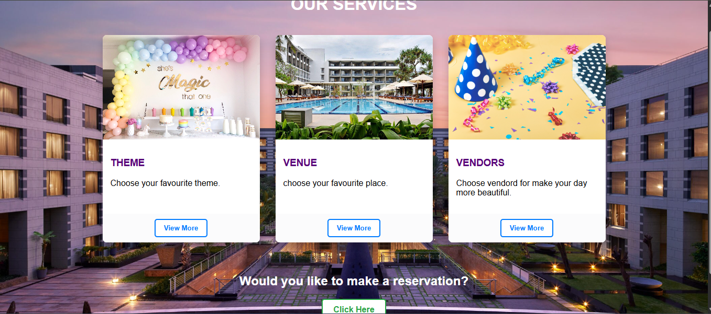
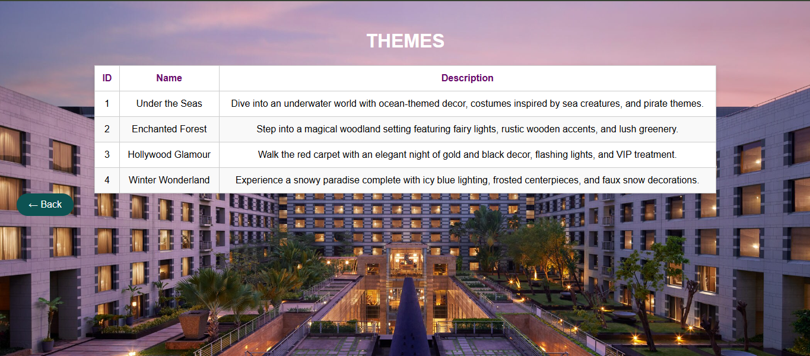
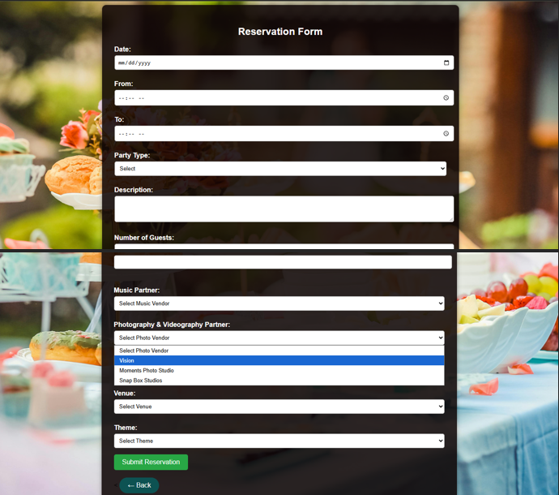
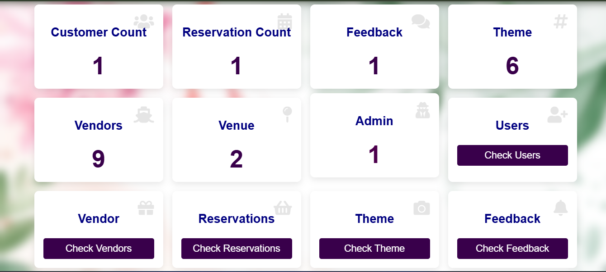
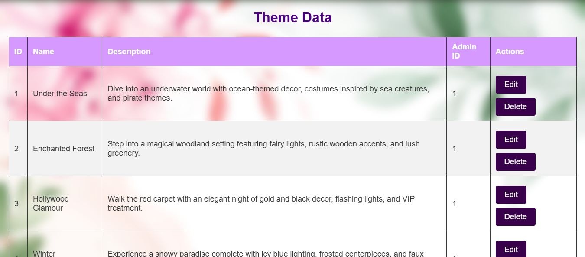

# Vibe Makers - Party Planning Management System

A full-stack web application designed to streamline event and party planning. This platform allows customers to browse event themes, explore photo galleries, book specialized vendors (music, food, photography), and submit reservations. It includes a comprehensive backend administrative dashboard for managing users, vendors, venues, and incoming bookings.

## 🚀 Features

*   **Customer Booking Portal:** Users can browse party packages, select themes (e.g., Under the Seas, Retro 80s Neon), and book venues.
*   **Vendor Integration:** Dedicated profiles and fee structures for diverse vendors, including DJs, catering services, and event photographers.
*   **Admin Dashboard:** Secure login for administrators to view reservations, manage vendor listings, and handle customer feedback.
*   **Interactive UI:** Fully responsive frontend utilizing Bootstrap 5 carousels, customized navigation bars, and Font Awesome social icons.

## 🛠️ Tech Stack

*   **Frontend:** HTML, CSS, JavaScript, Bootstrap
*   **Backend:** PHP
*   **Database:** MySQL
*   **Environment:** XAMPP / Laragon

## 📸 Screenshots

*The Vibe Makers customer landing page.*

*The Vibe Makers customer login page.*

*Customers can select custom music, food, and photography vendors.*

*Customers can see themes, music, food, and photography in detail.*

*Customers can make reservation*

*Secure administrative panel for managing database records.*

*Admin can Add, Edit and Delete the records*

## ⚙️ Local Installation & Setup

1. **Clone the repository:**
   `git clone https://github.com/your-username/party-planning-management.git`
2. **Set up the local server:**
   * Move the project folder into your local server's web directory (e.g., `C:\laragon\www\` for Laragon).
3. **Database Configuration:**
   * Open your database manager (e.g., HeidiSQL).
   * Create a new database named `party_planning_test`.
   * Import the `party_planning_test.sql` file provided in the repository to generate the tables and default data.
4. **Connect the Backend:**
   * Navigate to `Include/dbconnection.php`.
   * Verify that the credentials match your local environment.
5. **Launch the Application:**
   * Start your Apache and MySQL services in Laragon.
   * Open a web browser and navigate to `http://localhost/Party_planning/party-management-frontend/newWeb.php`.

## 🔑 Test Credentials

To test the application's login features, you can use the following default accounts included in the database dump:

**Admin Account**
* **Username:** `admin123`
* **Password:** `admin123`

**Customer Account**
* **Username:** `savindya`
* **Password:** `1234`

## 🤝 Contributing

Contributions, issues, and feature requests are welcome. Feel free to check the issues page if you want to contribute.

## 📄 License

This project is licensed under the MIT License.